

  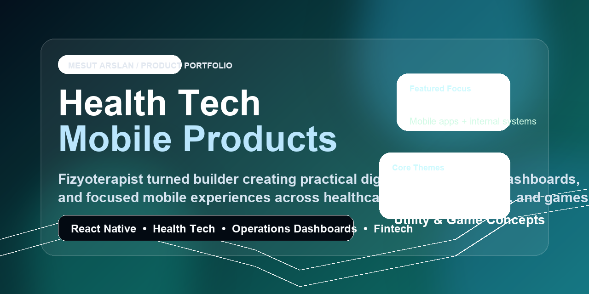

# Mesut Arslan

### Fizyoterapist - Mobile & Full Stack Developer - Health Tech Builder

Klinik ihtiyaclari, operasyonel sorunlari ve kullanici deneyimini bir araya getirerek gercek hayatta kullanilan dijital urunler tasarliyorum.

---

### Neyi Farkli Yapiyorum

- Saglik alanindan gelen bir gelistirici olarak problemi sahadan okuyup urune ceviriyorum.
- Mobil uygulama, operasyon paneli ve kullanici deneyimi tarafini birlikte dusunuyorum.
- Amacim sadece kod yazmak degil; tekrar tekrar kullanilacak, net problem cozen urunler cikarmak.

### Odak Alanlarim

- Health tech urunleri
- Fizyoterapi ve klinik is akislari
- React Native tabanli mobil uygulamalar
- Operasyon paneli ve ic araclar
- Secili fintech ve analiz urunleri

---

### One Cikan Urunler

| Proje | Rol | Kisa Aciklama |
|---|---|---|
| [ProGonyometre](https://github.com/mesutarslan44/ProGonyometre) | Mobile health tool | Telefon sensorleriyle eklem hareket acikligi olcumu |
| [fizyoterapi-gorev](https://github.com/mesutarslan44/fizyoterapi-gorev) | Internal ops dashboard | Gorev dagilimi, izin takibi ve ekip koordinasyonu |
| [mesutborsabist30](https://github.com/mesutarslan44/mesutborsabist30) | Fintech dashboard | BIST 30 odakli sinyal ve piyasa takip urunu |
| [IcGoru](https://github.com/mesutarslan44/IcGoru) | Wellbeing app | Duygu takibi ve oz-farkindalik odakli mobil urun |
| [SmileHeroExpo](https://github.com/mesutarslan44/SmileHeroExpo) | Habit app | Dis fircalama aliskanligini destekleyen oyunlastirilmis uygulama |
| [SnakePlanet](https://github.com/mesutarslan44/SnakePlanet) | Mobile game | Klasik yilan fikrini daha cilali mobil deneyime ceviren oyun |

---

### Vitrin Ekranlari

  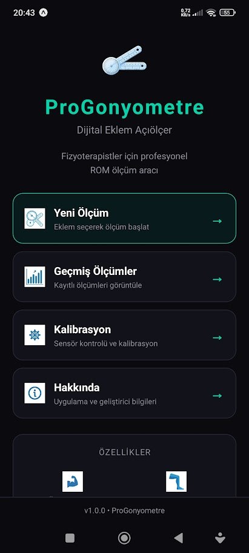
  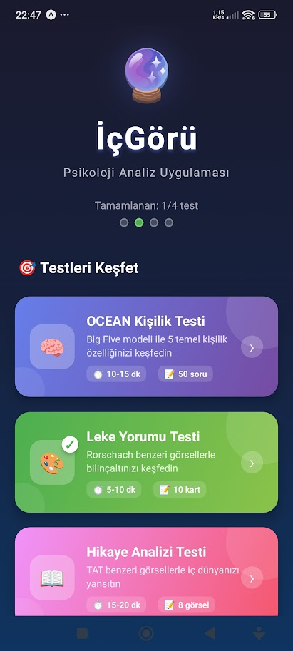
  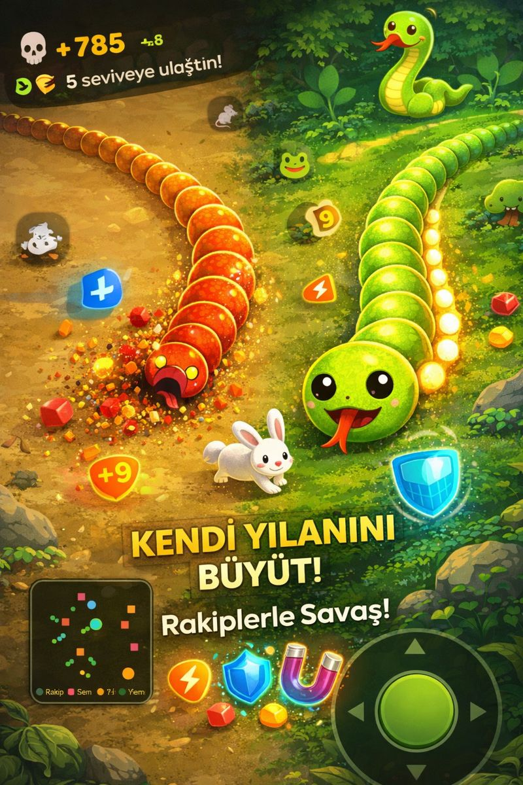

  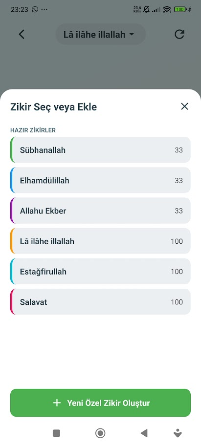
  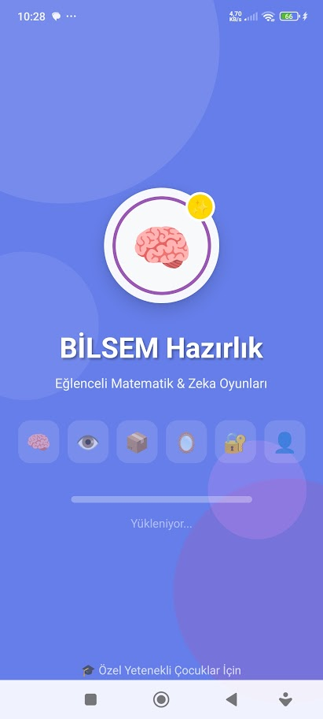
  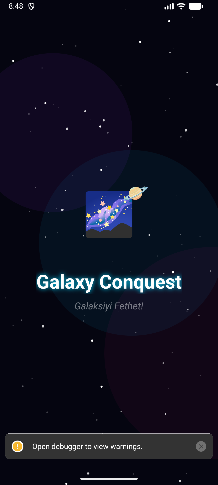
  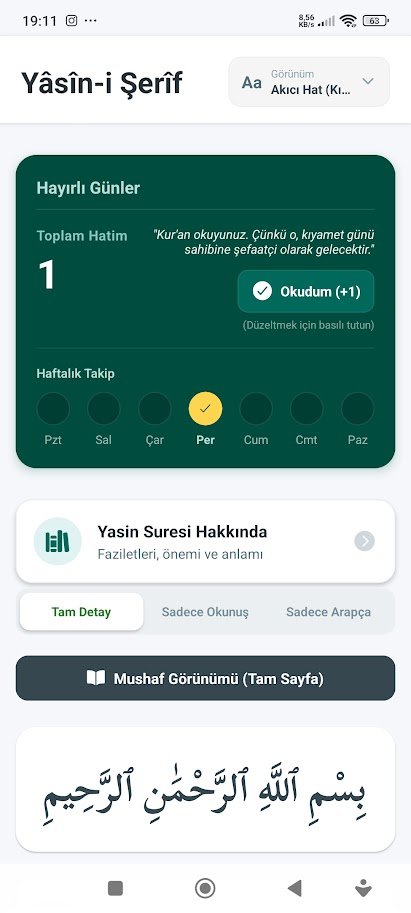

  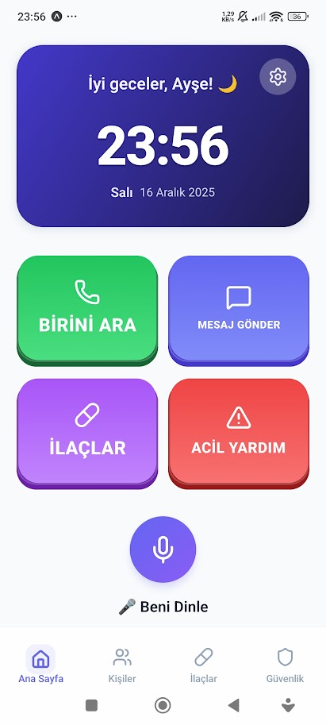
  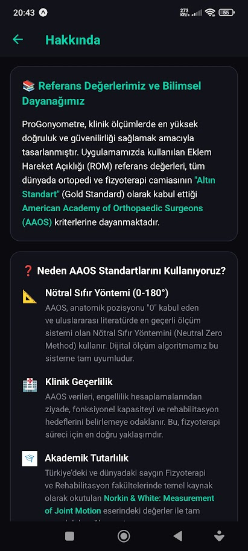

  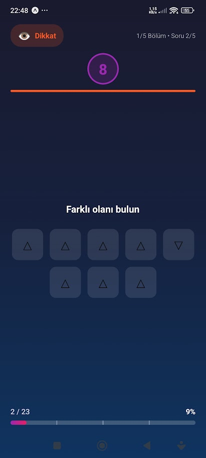
  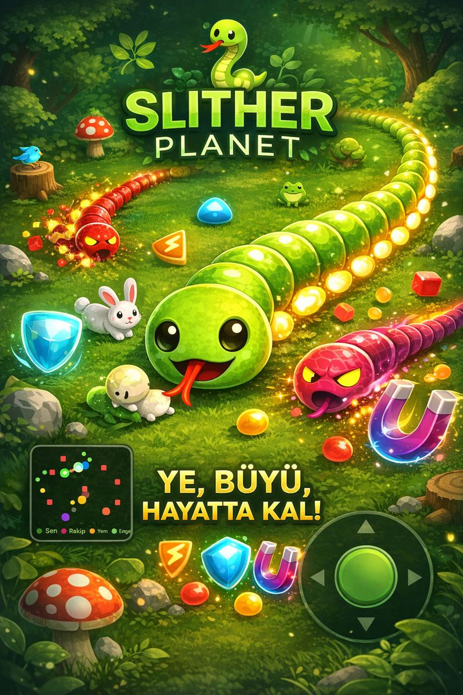
  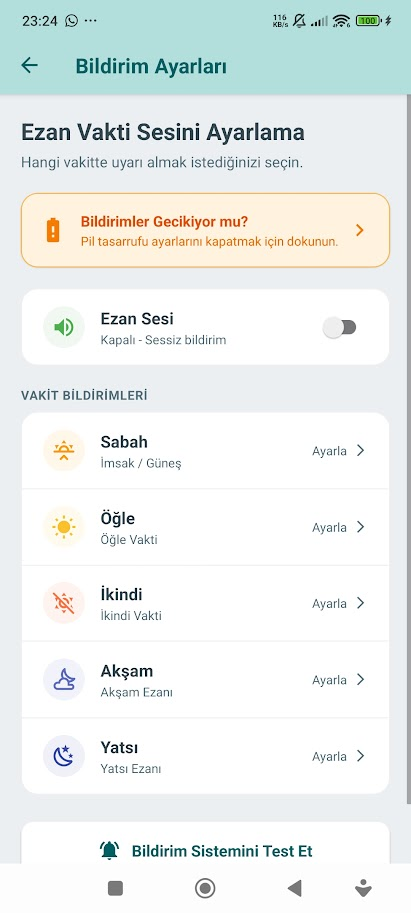
  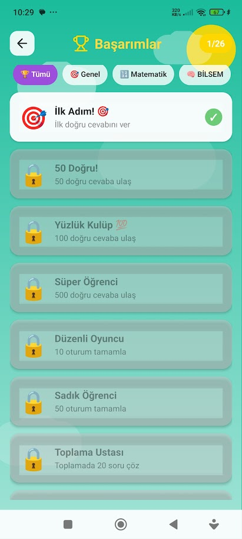

  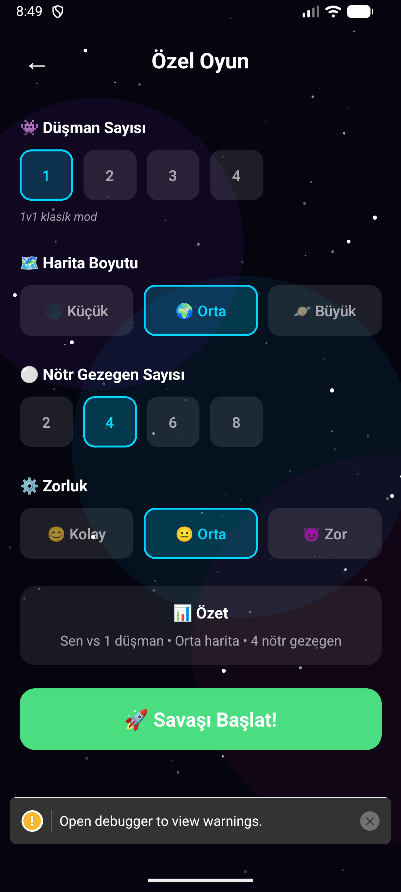
  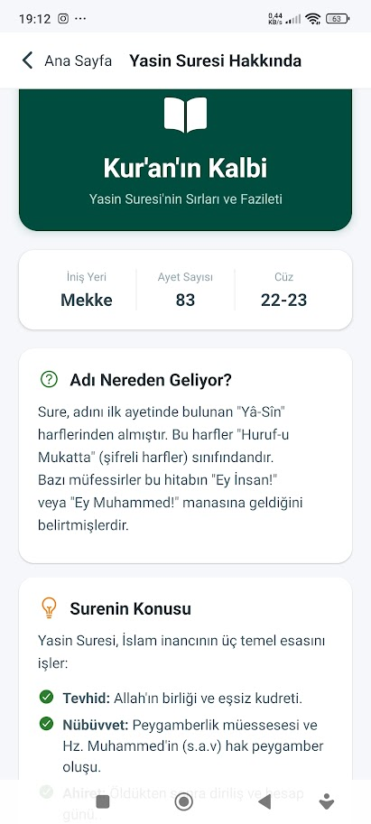
  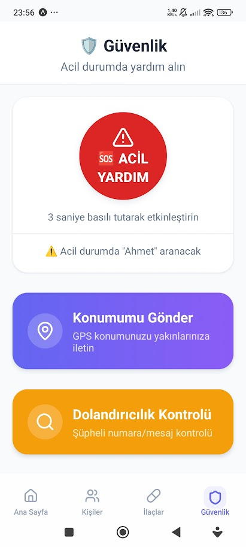

---

### Teknoloji Yiginim

---

**Saglik ve yazilimi bulusturan, urun odakli projeler gelistiriyorum.**

